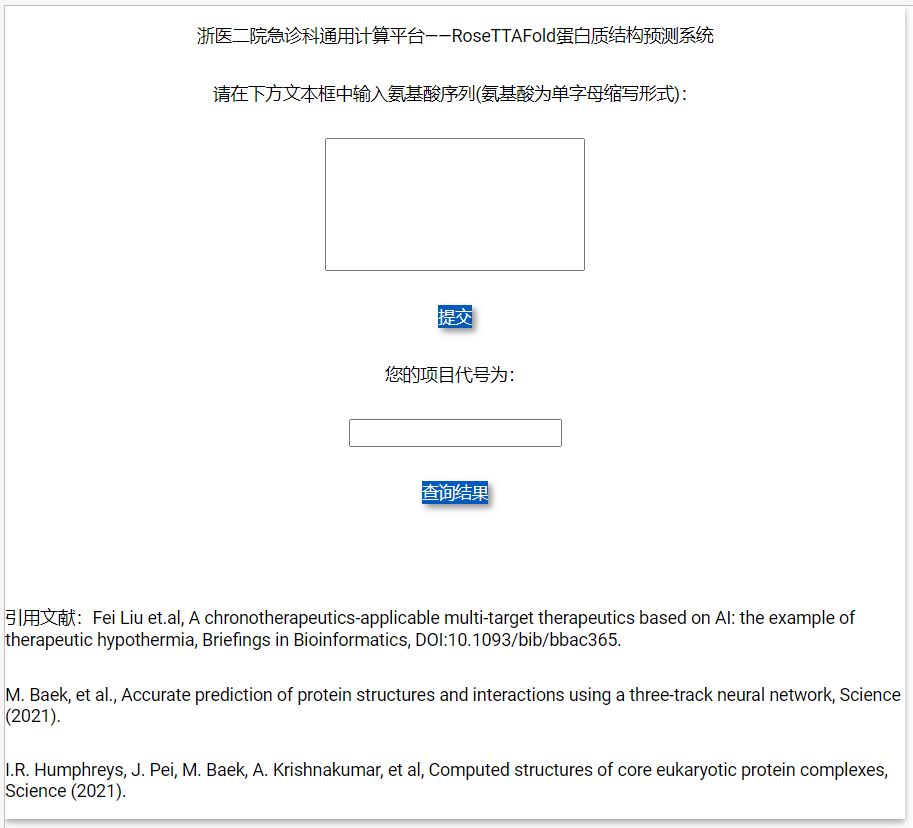

# RoseTTAFold-local-server

It is a simple local server of [RoseTTAFold](https://github.com/RosettaCommons/RoseTTAFold). Ubuntu ≥ 20.04 is recommended. Remember change the folder path in the code before running it.


## Environment:

The environment required `pandas` and `remi`. We recommend conda.
```
python = 3.8.10
pandas
remi
```

You can install from requirement file:

`conda install --yes --file requirements.txt`

Or, you can also install the environment by conda command:

`conda env create -f environment.yaml`

Then

`conda activate RFlocalserver`

Lastly, set up the server:

`python web.py`

It's important to note that, `background_service.py` need RoseTTAFold environment:
```shell
conda activate RoseTTAFold
python background_service.py`
```

## Context:

There are 2 parts: codes and running data.

### Codes include 3 files:

`web.py`: The website of the server. It will receive the amino acid sequence and write to `apply.csv`. The conda or python environment need `remi` library.

`background_server.py`: The background running program of the server.  When `apply.csv` is not empty, it will create the run indicator file `test.fa` and start calculation. When finish indicator file `model5.pdb` exist, it will shear the imformation from `apply.csv` to `result.csv`. The results will be  compressed into a `tar.gz` file and transferred to the `result` folder for `web.py` retrieval. Remember activate `RoseTTAFold` environment of conda before running it. The environment could refer to the github of [RoseTTAFold](https://github.com/RosettaCommons/RoseTTAFold).

`apply.sh` The running file. It will execute the RoseTTAFold run command and place the completed file in a specific location.

### Running data includes 3 files and 1 folder:

`running` folder include the calculating amino acid chain. After calculating, all the files in the folder will be compressed and move to specific folder.

`apply.csv` includes the applied mission from web. When calculation finishes, the first line would be move to `result.csv`.

`result.csv` records completed calculations. It includes the position of compressed file in specific folder.

## Citing this work

Fei Liu, Xiangkang Jiang, Jingyuan Yang, Jiawei Tao, Mao Zhang, A chronotherapeutics-applicable multi-target therapeutics based on AI: Example of therapeutic hypothermia, Briefings in Bioinformatics, 2022;, bbac365, https://doi.org/10.1093/bib/bbac365

M. Baek, et al., Accurate prediction of protein structures and interactions using a three-track neural network, Science (2021). 

I.R. Humphreys, J. Pei, M. Baek, A. Krishnakumar, et al, Computed structures of core eukaryotic protein complexes, Science (2021). 


## Screenshot


